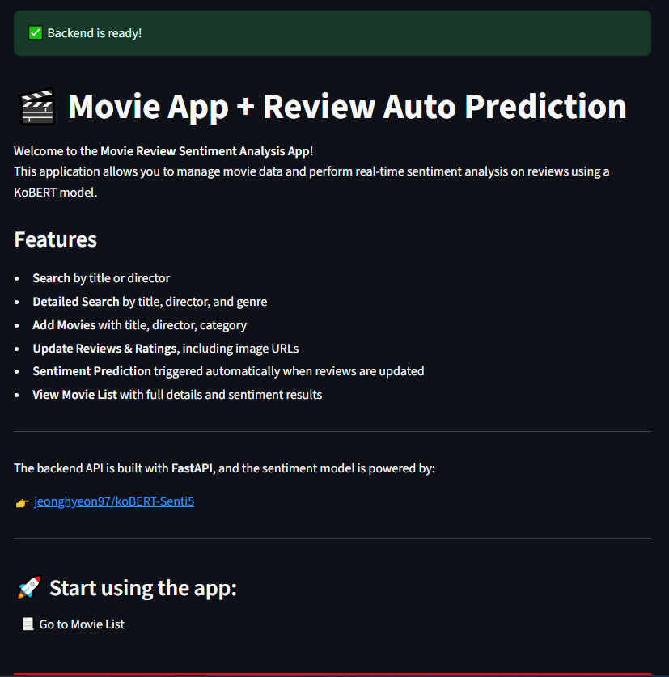

# Movie Information & Sentiment Analysis Web Application

## Streamlit UI


## Overview

This web-based application allows users to manage movie information and perform sentiment analysis on user reviews. It supports movie registration, search, update, and deletion features, while leveraging a KoBERT-based sentiment analysis model. The frontend uses Streamlit to provide a user-friendly visual interface.

## Features

- Register, search, update, and delete movie information
- Write and analyze user reviews with KoBERT-based sentiment analysis
- Visualize analysis results via Streamlit UI

## Technology Stack

| Component         | Technology                  |
|-------------------|-----------------------------|
| Frontend          | Streamlit                   |
| Backend           | FastAPI                     |
| Sentiment Model   | `jeonghyeon97/koBERT-Senti5` (HuggingFace) |
| Database          | SQLite + SQLModel           |
| Package Manager   | `uv`, `pyproject.toml`, `uv.lock` |
| Deployment        | Docker, Docker Compose, Streamlit Cloud, GitHub |

## Getting Started

### Access Deployed App

- Streamlit Cloud URL: [https://movieapp-hgp9gvaoeirbbykpxflrr9.streamlit.app/](https://movieapp-hgp9gvaoeirbbykpxflrr9.streamlit.app/)

### Local Deployment with Docker Compose

Use the following `docker-compose.yaml` snippet to run backend and frontend containers locally:

```yaml
services:
  fastapi-backend:
    image: keugmogu/backend:latest
    ports:
      - "8000:8000"
    volumes:
      - ./backend/movies.db:/app/movies.db

  streamlit-frontend:
    image: keugmogu/frontend:latest
    ports:
      - "8501:8501"
```


# Project Structure

```plaintext
Mission18/
├── backend/
│   ├── main.py               # FastAPI server entry point
│   ├── movies.db             # SQLite database file
│   ├── Dockerfile            # Backend Dockerfile
│   ├── pyproject.toml        # Backend dependencies
│   └── uv.lock               # Backend package lock file
├── frontend/
│   ├── pages/
│   │   ├── 1_Movie_List.py   # Movie listing & deletion
│   │   ├── 2_Search.py       # Movie search
│   │   ├── 3_Add_Movie.py    # Add new movie
│   │   └── 4_Update_Movie.py # Update movie info & sentiment analysis
│   ├── utils/
│   │   └── utils.py          # Common API calls and helpers
│   ├── app.py                # Streamlit app entry point
│   ├── Dockerfile            # Frontend Dockerfile
│   ├── pyproject.toml        # Frontend dependencies
│   └── uv.lock               # Frontend package lock file
└── docker-compose.yaml       # Docker Compose configuration
```
# System Architecture
- Frontend: Streamlit UI for user interaction
- Backend: FastAPI REST API handling movie CRUD and review analysis
- Database: SQLite storing movie data and analysis results
- Model: KoBERT sentiment classifier invoked by backend

# API Endpoints (Summary)
| Method | Endpoint                      | Description                       |
| ------ | ----------------------------- | --------------------------------- |
| GET    | `/health`                     | Health check                      |
| GET    | `/movies`                     | List all movies                   |
| GET    | `/movies/titles/{title}`      | Search movies by title            |
| GET    | `/movies/director/{director}` | Search movies by director         |
| GET    | `/movies/search`              | Multi-condition search            |
| POST   | `/movies`                     | Add a new movie                   |
| POST   | `/movies/{movie_id}/review`   | Add a review and trigger analysis |
| POST   | `/movies/review_analyze`      | Batch analyze reviews             |
| PUT    | `/movies/{movie_id}`          | Update movie info                 |
| DELETE | `/movies/{movie_id}`          | Delete a movie                    |


# User Interface & Flow
- **Main Page:** Entry point with navigation
- **Movie List:** Browse, view details, and delete movies
- **Search:** Simple or detailed search by title, director, category
- **Add Movie:** Register new movies
- **Update Movie:** Edit movie info and perform sentiment analysis on reviews
- Sentiment scores are shown as probabilities between 0 (negative) and 1 (positive)
